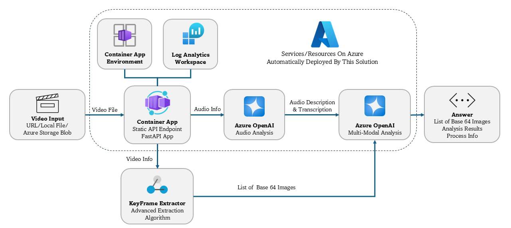

# AI Video Analyzer On Azure

A comprehensive AI-powered video analysis solution on Azure. This solution enables **intelligent, customizable** video content analysis through frame extraction, audio transcription, and multimodal AI processing.

## Features

- **🎯 Intelligent Video Analysis**: AI-powered content analysis using Azure OpenAI Services
- **📹 Smart Keyframe Extraction**: Advanced algorithms with optical flow, scene detection, and similarity deduplication
- **🎵 Multi-Model Audio Analysis**: Support for multiple audio models
- **🌐 RESTful Web API**: FastAPI-based service with automatic OpenAPI documentation
- **🐳 Cloud-Native Deployment**: Docker containerized with Azure Container Apps support
- **⚡ High Performance**: Optimized processing with configurable extraction parameters
- **🎨 Image Enhancement**: Automatic enhancement for low-light and blurry content
- **📊 Flexible Input Sources**: Support for URLs, Azure Blob Storage, and file uploads

## Architecture



## Prerequisites

- **PowerShell 7.0+** or **Bash 4.0+** (for deployment)
- **Azure CLI 2.55.0+**
- **jq 1.6+** (JSON processing utility)
- **Azure Subscription** with sufficient quota for:
  - Azure OpenAI Service
  - Azure Container Apps
  - Azure Container Registry
  - Azure Log Analytics

## Quick Start

### 1. Clone Repository

```bash
git clone https://github.com/t-yuningzhu_microsoft/video-analyzer-solution.git
cd video-analyzer-solution
```

### 2. Configure Deployment

Edit [`deploy.parameters.json`](deploy.parameters.json), configure the following settings:

- Check and modify default parameters in this file.

- Add and configure the storage account details if your project requires video retrieval from Azure Blob Storage.
- The solution will deploy OpenAI Services in the same location you chose to place your Resource Group. However, some models may only be accessible in specific regions, check [Azure OpenAI in Azure AI Foundry Models - Azure OpenAI | Microsoft Learn](https://learn.microsoft.com/en-us/azure/ai-foundry/openai/concepts/models?tabs=global-standard%2Cstandard-chat-completions#model-summary-table-and-region-availability) to make sure your model is available in your chosen location. 
  - If you have to specify your OpenAI Service locations, add `AZURE_OPENAI_DEPLOYMENT_LOCATION` and `AUDIO_DEPLOYMENT_LOCATION` in this file.


```json
{
  "LOCATION": "eastus2",
  "RESOURCE_GROUP": "video-analyzer-rg",
  "RESOURCE_BASE_NAME": "video-analyzer-base",
  
  "AZURE_OPENAI_DEPLOYMENT_NAME": "gpt-4.1-mini",
  "AZURE_OPENAI_API_VERSION": "2024-02-15-preview",
  
  "AUDIO_DEPLOYMENT_NAME": "gpt-4o-audio-preview",
  "AUDIO_DEPLOYMENT_NAME_V2": "whisper", 
  "AUDIO_DEPLOYMENT_NAME_V3": "gpt-4o-mini-transcribe",
  "AUDIO_API_VERSION": "2025-01-01-preview",
  
  "CHAT_MODEL_NAME": "gpt-4.1-mini",
  "CHAT_MODEL_VERSION": "2025-04-14",
  "CHAT_SKU_CAPACITY": "250",
  "CHAT_SKU_NAME": "GlobalStandard",
  
  "AUDIO_MODEL_NAME": "gpt-4o-audio-preview",
  "AUDIO_MODEL_VERSION": "2024-12-17",
  "AUDIO_SKU_CAPACITY": "250",
  "AUDIO_SKU_NAME": "GlobalStandard",
  
  "AUDIO_V2_MODEL_NAME": "gpt-4o-transcribe",
  "AUDIO_V2_MODEL_VERSION": "2025-03-20",
  "AUDIO_V2_SKU_CAPACITY": "100",
  "AUDIO_V2_SKU_NAME": "GlobalStandard",
  
  "AUDIO_V3_MODEL_NAME": "gpt-4o-mini-transcribe",
  "AUDIO_V3_MODEL_VERSION": "2025-03-20",
  "AUDIO_V3_SKU_CAPACITY": "100",
  "AUDIO_V3_SKU_NAME": "GlobalStandard",

  // Optional, you should add these parameters into your .json file if you need storage account for input.
  "AZURE_STORAGE_ACCOUNT_NAME": "replace-with-your-storage-account-name",
  "AZURE_STORAGE_ACCOUNT_KEY": "replace-with-your-storage-account-key",
  "AZURE_STORAGE_CONTAINER_NAME": "replace-with-your-storage-container-name"
}
```

### 3. Deploy to Azure

This solution will automatically create a **Resource Group**, an **Azure Container App**, a **Log Analytics Workspace** and two **Azure OpenAI Services** (one for chat model and one for audio models) for deployment, edit your corresponding deployment script for customized deploy choices.

**Windows (PowerShell):**

```powershell
Set-ExecutionPolicy -ExecutionPolicy Bypass -Scope Process
.\deploy.ps1 -ParametersFile deploy.parameters.json -DeveloperMode
```

**Linux/macOS (Bash):**

```bash
./deploy.sh -p deploy.parameters.json -d
```

### 4. Access Your API

After successful deployment:

- **API Endpoint**: `https://your-app.region.azurecontainerapps.io`
- **Interactive Documentation**: `https://your-app.region.azurecontainerapps.io/docs`
- **Health Check**: `https://your-app.region.azurecontainerapps.io/health`

## API Usage

**Only include the required parameters in the request body; optional parameters can be omitted or set as needed.**

### Analyze Video from URL

```bash
curl -X POST "https://your-app.region.azurecontainerapps.io/analyze-video-url" \
     -H "Content-Type: application/json" \
     -d '{
       "video_url": "https://example.com/video.mp4",
       "user_prompt": "Analyze this video and describe the main content, scenes, and key events",
       "enable_audio_analysis": true,
       "max_frames": 12,
       "audio_enable_v2": true,
       "audio_enable_v3": false
     }'
```

### Analyze Video from Azure Blob Storage

```bash
curl -X POST "https://your-app.region.azurecontainerapps.io/analyze-video-url" \
     -H "Content-Type: application/json" \
     -d '{
       "video_url": "your/storage/path/video.mp4",
       "user_prompt": "Analyze this video and describe the main content, scenes, and key events"
     }'
```

### Upload and Analyze Video File

```bash
curl -X POST "https://your-app.region.azurecontainerapps.io/analyze-video-file" \
     -F "file=@/path/to/video.mp4" \
     -F "enable_audio_analysis=true" \
     -F "max_frames=15" \
     -F "min_time_gap=1.0" \
     -F "enable_image_enhancement=true" \
     -F "user_prompt=Provide a detailed analysis of this video content"
```

## Audio Analysis Models

### Model Capabilities

This solution supports up to **3 audio analysis models** to describe or transcribe the audio part for your video input. You can always customize them with your own models. The **Main Model** by default is `GPT-4o-audio-preview`, which is a chat completion model that is capable to analyze the audio clip based on your intended purpose. We recommend to use this model as the **Main Model** since it is not only capable to transcribe human conversations, but also compatible to describe sentiment, background noise and more. You can configure a **Audio V2 Model**  and a **Audio V3 Model** for use cases that require standard transcription or highly accurate transcription. If you do not prefer a chat completion model to be used as the **Main Model**, edit [`audio_extractor.py`](utils/audio_extractor.py) to make sure the API format is compatible with your **Main Model.**

| Model              | Default Model             | Explanation                                                  |
| ------------------ | ------------------------- | ------------------------------------------------------------ |
| **Main Model**     | gpt-4o-audio-preview      | Chat completion model for most audio analysis scenarios.     |
| **Audio V2 Model** | gpt-4o-transcribe/whisper | Audio model, set to help comprehensive analysis, use whisper if your subscription have sufficient quota. |
| **Audio V3 Model** | gpt-4o-mini-transcribe    | Audio model, set to help comprehensive analysis.             |

### Multi-Model Analysis Example

```bash
{
    "video_url": "https://example.com/presentation.mp4",
    "enable_audio_analysis": true,
    "audio_enable_v2": true,
    "audio_enable_v3": true,
    "audio_prompt": "Summarize the key points and identify the speakers",
    "max_frames": 15,
    "enable_image_enhancement": true
}
```

## Configuration Parameters

### Core Analysis Parameters

| Parameter               | Type    | Default      | Description                             |
| ----------------------- | ------- | ------------ | --------------------------------------- |
| `video_url`             | string  | **Required** | Video URL or Azure Blob path            |
| `system_prompt`         | string  | Optional     | System instruction for AI analysis      |
| `user_prompt`           | string  | Optional     | Specific questions about the video      |
| `enable_audio_analysis` | boolean | `false`      | Enable audio transcription and analysis |

### Keyframe Extraction Parameters

| Parameter                  | Type    | Default | Description                                                  |
| -------------------------- | ------- | ------- | ------------------------------------------------------------ |
| `max_frames`               | int     | `12`    | Maximum number of keyframes to extract                       |
| `min_time_gap`             | float   | `0.8`   | Minimum time gap between frames (seconds)                    |
| `enable_image_enhancement` | boolean | `false` | Enable image quality enhancement                             |
| `min_frames_after_dedup`   | int     | `3`     | Minimum frames after deduplication                           |
| `frame_gap`                | int     | `5`     | Frame analysis interval (higher = faster)                    |
| `enable_deduplication`     | boolean | `true`  | Enable similar frame removal                                 |
| `similarity_threshold`     | float   | `0.95`  | Similarity threshold for deduplication (0-1)                 |
| `maximum_dimension`        | int     | `480`   | Maximum dimension for processing keyframes (this parameter does not affect the resolution of the keyframes sent to LLMs) |

### Algorithm Weight Parameters

| Parameter           | Type  | Default | Description                         |
| ------------------- | ----- | ------- | ----------------------------------- |
| `motion_weight`     | float | `3.0`   | Weight for motion change detection  |
| `scene_weight`      | float | `1.5`   | Weight for scene change detection   |
| `color_weight`      | float | `0.5`   | Weight for color histogram changes  |
| `edge_weight`       | float | `2.0`   | Weight for edge detection changes   |
| `content_frame_bar` | float | `0.5`   | Content frame selection ratio (0-1) |

### Audio Analysis Parameters

| Parameter         | Type    | Default  | Description                      |
| ----------------- | ------- | -------- | -------------------------------- |
| `audio_enable_v2` | boolean | `false`  | Enable Audio V2 model            |
| `audio_enable_v3` | boolean | `false`  | Enable Audio V3 model            |
| `audio_prompt`    | string  | Optional | Custom prompt for audio analysis |

## Response Format

```json
{
  "success": true,
  "mode": "local_video",
  "video_info": {
    "original_input": "/path/to/original/input.mp4",
    "local_path": "/path/to/loal/path.mp4",
    "is_temp_file": false,
    "processing_time": 15.947985
  },
  "extraction_result": {
    "keyframes_count": 3,
    "keyframes": [
      {
        "frame_number": 20,
        "timestamp": 0.8,
        "base64_image": "data:image/jpeg;base64,/9j/4AAQ..."
      },
      {
        "frame_number": 85,
        "timestamp": 3.4,
        "base64_image": "data:image/jpeg;base64,/9j/4AAQ..."
      },
      {
        "frame_number": 145,
        "timestamp": 5.8,
        "base64_image": "data:image/jpeg;base64,/9j/4AAQ..."
      }
    ],
    "extraction_params": {
      "video_path": "/path.to/video.mp4",
      "max_frames": 12,
      "min_time_gap": 0.8,
      "enable_image_enhancement": false,
      "min_frames_after_dedup": 3,
      "frame_gap": 5,
      "motion_weight": 3,
      "scene_weight": 1.5,
      "color_weight": 0.5,
      "edge_weight": 2,
      "content_frame_bar": 0.5,
      "enable_deduplication": true,
      "similarity_threshold": 0.95,
      "maximum_dimension": 480
    }
  },
  "audio_analysis_result": {
    "success": true,
    "analysis": "audio analysis result...",
    "analysis_time": 1.96,
    "results": {
      "main": {
        "success": true,
        "analysis": "main model result...",
        "analysis_time": 1.42,
        "usage": {
          "completion_tokens": 91,
          "prompt_tokens": 157,
          "total_tokens": 248,
          "completion_tokens_details": {
            "accepted_prediction_tokens": 0,
            "audio_tokens": 0,
            "reasoning_tokens": 0,
            "rejected_prediction_tokens": 0
          },
          "prompt_tokens_details": {
            "audio_tokens": 97,
            "cached_tokens": 0
          }
        },
        "model": "gpt-4o-audio-preview",
        "prompts": {
          "system_prompt": "",
          "user_prompt": "audio analysis prompt..."
        }
      },
      "v3": {
        "success": true,
        "analysis": "V3 audio analysis result...",
        "analysis_time": 0.54,
        "model": "gpt-4o-mini-transcribe"
      }
    },
    "models_used": [
      "main",
      "v3"
    ]
  },
  "analysis_result": {
    "success": true,
    "analysis": "Comprehensive analysis of the video input...",
    "usage": {
      "completion_tokens": 219,
      "prompt_tokens": 1147,
      "total_tokens": 1366,
      "completion_tokens_details": {
        "accepted_prediction_tokens": 0,
        "audio_tokens": 0,
        "reasoning_tokens": 0,
        "rejected_prediction_tokens": 0
      },
      "prompt_tokens_details": {
        "audio_tokens": 0,
        "cached_tokens": 0
      }
    },
    "model": "gpt-4.1-mini-2025-04-14",
    "frames_count": 6,
    "audio_analysis_included": true,
    "audio_analysis_status": true
  },
  "pipeline_info": {
    "start_time": "2025-08-29T04:19:55.043171",
    "total_processing_time": 15.947985,
    "audio_analysis_enabled": true,
    "usage": {
      "vision_usage": {
        "completion_tokens": 219,
        "prompt_tokens": 1147,
        "total_tokens": 1366,
        "completion_tokens_details": {
          "accepted_prediction_tokens": 0,
          "audio_tokens": 0,
          "reasoning_tokens": 0,
          "rejected_prediction_tokens": 0
        },
        "prompt_tokens_details": {
          "audio_tokens": 0,
          "cached_tokens": 0
        }
      },
      "audio_usage": {
        "completion_tokens": 91,
        "prompt_tokens": 157,
        "total_tokens": 248,
        "completion_tokens_details": {
          "accepted_prediction_tokens": 0,
          "audio_tokens": 0,
          "reasoning_tokens": 0,
          "rejected_prediction_tokens": 0
        },
        "prompt_tokens_details": {
          "audio_tokens": 97,
          "cached_tokens": 0
        }
      }
    }
  }
}
```

## Local Development

### Environment Setup

1. **Install Dependencies**

```bash
pip install -r requirements.txt
```

2. **Configure Environment Variables**

```bash
# Create .env file
# Chat OpenAI Service
AZURE_OPENAI_ENDPOINT=https://your-openai.openai.azure.com/
AZURE_OPENAI_API_KEY=your-api-key
AZURE_OPENAI_DEPLOYMENT_NAME=gpt-4.1-mini
AZURE_OPENAI_API_VERSION=2024-02-15-preview

# Audio OpenAI Service  
AUDIO_ENDPOINT_URL=https://your-audio-openai.openai.azure.com/
AUDIO_AZURE_OPENAI_API_KEY=your-audio-api-key
AUDIO_DEPLOYMENT_NAME=gpt-4o-audio-preview
AUDIO_DEPLOYMENT_NAME_V2=whisper
AUDIO_DEPLOYMENT_NAME_V3=gpt-4o-mini-transcribe

# Azure Storage (Optional)
AZURE_STORAGE_ACCOUNT_NAME=your-storage-account
AZURE_STORAGE_ACCOUNT_KEY=your-storage-key
AZURE_STORAGE_CONTAINER_NAME=your-storage-container
```

### Run Development Server

```bash
# Start the FastAPI server
python api.py

# Or with uvicorn directly
uvicorn api:app --host 0.0.0.0 --port 5000 --reload
```

Access the development server:

- **API**: http://localhost:5000
- **Documentation**: http://localhost:5000/docs
- **Health Check**: http://localhost:5000/health

### Command Line Interface

```bash
# Analyze a local video file
python utils/main.py /path/to/video.mp4 \
    --enable-audio-analysis \
    --max-frames 10 \
    --user-prompt "Describe the main content"

# Analyze from Azure Blob
python utils/main.py container/video.mp4 \
    --audio-enable-v2 \
    --enable-image-enhancement
```

## Project Structure

```
video-analyzer-solution/
├── api.py                      # FastAPI web service entry point
├── utils/                      # Core processing modules
│   ├── main.py                 # Main video processing orchestrator
│   ├── analyzer.py             # Azure OpenAI integration for vision analysis
│   ├── audio_extractor.py      # Audio extraction and multi-model analysis
│   └── frame_extractor.py      # Advanced keyframe extraction algorithms
├── deploy.ps1                  # Windows PowerShell deployment script
├── deploy.sh                   # Linux/macOS bash deployment script
├── deploy.parameters.json      # Deployment configuration template
├── Dockerfile                  # Container build configuration
├── requirements.txt            # Python package dependencies
└── README.md                   # Project documentation
```

## Performance Optimization

### Video Processing

- **Frame Sampling**: Increase `frame_gap` for large videos
- **Resolution Control**: Use `maximum_dimension` to limit processing size
- **Memory Management**: Disable `enable_deduplication` for very long videos
- **Parallel Processing**: Process multiple videos concurrently

### Azure OpenAI Optimization

- **Batch Processing**: Group similar requests
- **Model Selection**: Choose appropriate models for use case
- **Caching**: Implement response caching for repeated analyses
- **Quota Management**: Monitor and manage API quotas

## Troubleshooting

### Common Issues

| Issue                | Cause                         | Solution                                   |
| -------------------- | ----------------------------- | ------------------------------------------ |
| Deployment fails     | Azure CLI not logged in       | Run `az login`                             |
| API returns 500      | Missing environment variables | Check Container Apps configuration         |
| Audio analysis fails | Model not deployed            | Verify Azure OpenAI deployments            |
| Out of memory        | Large video files             | Reduce `max_frames` or `maximum_dimension` |

### Debugging Commands

```bash
# Check deployment status
az deployment group show --resource-group your-rg --name video-analyzer

# View container logs
az containerapp logs show --name your-app --resource-group your-rg --tail 100

# Test API health
curl https://your-app.azurecontainerapps.io/health

# Check Azure OpenAI quota
az cognitiveservices account show --name your-openai --resource-group your-rg
```

### Log Analysis

```bash
# Monitor real-time logs
az containerapp logs tail --name your-app --resource-group your-rg

# Search for specific errors
az containerapp logs show --name your-app --resource-group your-rg | grep "ERROR"
```

## Support

### Getting Help

1. **Issues**: Search existing issues or create a new one
2. **Discussions**: Use GitHub Discussions for questions
3. **Azure Support**: Contact Azure support for service-specific issues

### Useful Links

- [Azure OpenAI Documentation](https://docs.microsoft.com/en-us/azure/cognitive-services/openai/)
- [Azure Container Apps Documentation](https://docs.microsoft.com/en-us/azure/container-apps/)
- [FastAPI Documentation](https://fastapi.tiangolo.com/)
- [OpenCV Documentation](https://docs.opencv.org/)

---

**Built with ❤️ by the GCR DN Tech Team at Microsoft**